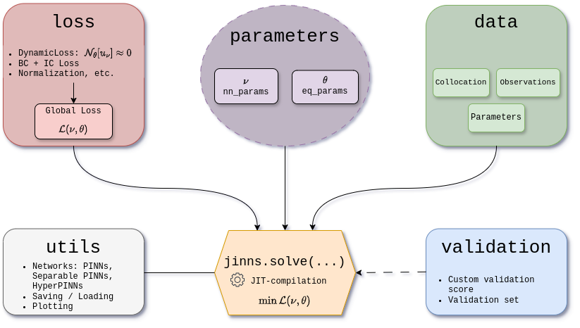

jinns
=====

 

Physics Informed Neural Networks with JAX. **jinns** is developed to estimate solutions of ODE and PDE problems using neural networks, with a strong focus on

 1. inverse problems: find equation parameters given noisy/indirect observations
 2. meta-modeling: solve for a parametric family of differential equations

It can also be used for forward problems and hybrid-modeling.

**jinns** specific points:

- **jinns uses JAX** - It is directed to JAX users: forward and backward autodiff, vmapping, jitting and more! No reinventing the wheel: it relies on the JAX ecosystem whenever possible, such as [equinox](https://github.com/patrick-kidger/equinox/) for neural networks or [optax](https://optax.readthedocs.io/) for optimization.

- **jinns is highly modular** - It gives users maximum control for defining their problems, and extending the package. The maths and computations are visible and not hidden behind layers of code!

- **jinns is efficient** - It compares favorably to other existing Python package for PINNs on the [PINNacle benchmarks](https://github.com/i207M/PINNacle/), as demonstrated in the table below. For more details on the benchmarks, checkout the [PINN multi-library benchmark](https://gitlab.com/mia_jinns/pinn-multi-library-benchmark)

- Implemented PINN architectures
    - Vanilla Multi-Layer Perceptron popular accross the PINNs litterature.

    - [Separable PINNs](https://openreview.net/pdf?id=dEySGIcDnI): allows to leverage forward-mode autodiff for computational speed.

    - [Hyper PINNs](https://arxiv.org/pdf/2111.01008.pdf): useful for meta-modeling


- **Get started**: check out our various notebooks on the [documentation](https://mia_jinns.gitlab.io/jinns/index.html).

|  | jinns | DeepXDE - JAX | DeepXDE - Pytorch | PINA | Nvidia Modulus |
|---|:---:|:---:|:---:|:---:|:---:|
| Burgers1D | **445** | 723 | 671 | 1977 | 646 |
| NS2d-C | **265** | 278 | 441 | 1600 | 275 |
| PInv | 149 | 218 | *CC* | 1509 | **135** |
| Diffusion-Reaction-Inv | **284** | *NI* | 3424 | 4061 | 2541 |
| Navier-Stokes-Inv | **175** | *NI* | 1511 | 1403 | 498 |

*Training time in seconds on an Nvidia T600  GPU. NI means problem cannot be implemented in the backend, CC means the code crashed.*




# Installation

Install the latest version with pip

```bash
pip install jinns
```

# Documentation

The project's documentation is hosted on Gitlab page and available at [https://mia_jinns.gitlab.io/jinns/index.html](https://mia_jinns.gitlab.io/jinns/index.html).


# Found a bug / want a feature ?

Open an issue on the [Gitlab repo](https://gitlab.com/mia_jinns/jinns/-/issues).


# Contributing

Here are the contributors guidelines:

1. First fork the library on Gitlab.

2. Then clone and install the library in development mode with

```bash
pip install -e .
```

3. Install pre-commit and run it.

```bash
pip install pre-commit
pre-commit install
```

 4. Open a merge request once you are done with your changes, the review will be done via Gitlab.

# Contributors

Don't hesitate to contribute and get your name on the list here !

**List of contributors:** Hugo Gangloff, Nicolas Jouvin, Lucia Clarotto, Inass Soukarieh

# Cite us

Please consider citing our work if you found it useful to yours, using this [ArXiV preprint](https://arxiv.org/abs/2412.14132)
```
@article{gangloff_jouvin2024jinns,
  title={jinns: a JAX Library for Physics-Informed Neural Networks},
  author={Gangloff, Hugo and Jouvin, Nicolas},
  journal={arXiv preprint arXiv:2412.14132},
  year={2024}
}
```
